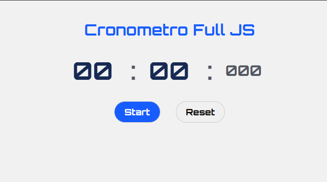

⏱️ Cronometro_JS

Um cronômetro desenvolvido com JavaScript puro, com a interface criada dinamicamente através da DOM API.

Este projeto faz parte dos meus estudos de JavaScript e foi desenvolvido para praticar lógica de programação, manipulação do DOM, eventos, controle de estado e funções de formatação.

📸 Preview

  

🌐 Projeto online

🔗 <a href="https://cronometro-full-js.vercel.app/" target="_blank">Acessar o Cronometro_JS</a>

🚀 Funcionalidades

▶️ Iniciar o cronômetro

⏸️ Pausar o cronômetro

▶️ Retomar a contagem

🔄 Reiniciar o cronômetro

⏱️ Contagem de minutos, segundos e milissegundos

🔢 Formatação dos valores com zeros à esquerda

🛠️ Tecnologias utilizadas

HTML5

CSS3

JavaScript

DOM API

Google Fonts — Orbitron

🧠 Conceitos praticados

JavaScript

Variáveis e constantes

Funções

Condicionais

Operadores

Eventos

addEventListener()

setInterval()

clearInterval()

Operador ternário

padStart()

Manipulação do DOM

querySelector()

createElement()

classList.add()

setAttribute()

appendChild()

textContent

Controle do cronômetro

O funcionamento do cronômetro utiliza variáveis para controlar:

minutes
seconds
milliseconds
isPaused
interval

O estado isPaused controla se a contagem deve continuar enquanto o intervalo permanece ativo.

🎨 Interface

A interface utiliza uma paleta simples com tons de azul, cinza e branco, combinada com a fonte Orbitron para reforçar a aparência de um cronômetro digital.

📂 Estrutura do projeto

Cronometro_JS/
├── index.html
├── css/
│   └── style.css
├── js/
│   └── scripts.js
└── images/
    └── cronometro.png

🎯 Objetivo do projeto

O objetivo principal foi praticar a construção de uma aplicação utilizando JavaScript puro, criando os elementos da interface através do JavaScript e implementando toda a lógica do cronômetro sem utilizar frameworks.

Este projeto faz parte da preparação para etapas posteriores dos meus estudos em desenvolvimento web.

📌 Status

✅ Projeto concluído

👨‍💻 Autor

Luiz Davi

Estudante de Engenharia de Software e desenvolvedor em formação, com foco atual em JavaScript e desenvolvimento Web.

⭐ Projeto desenvolvido para fins de estudo e prática.